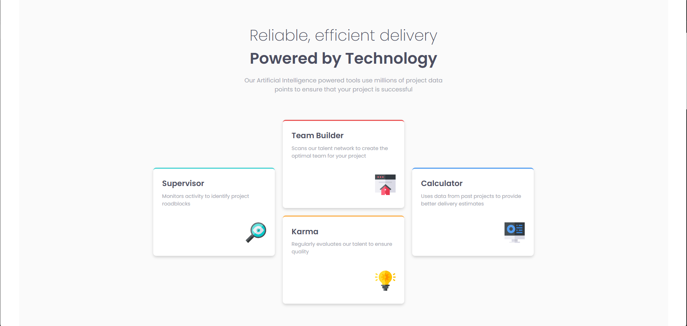

# Frontend Mentor - Four card feature section solution

This is a solution to the [Four card feature section challenge on Frontend Mentor](https://www.frontendmentor.io/challenges/four-card-feature-section-weK1eFYK). Frontend Mentor challenges help you improve your coding skills by building realistic projects. 

## Table of contents

- [Overview](#overview)
  - [The challenge](#the-challenge)
  - [Screenshot](#screenshot)
  - [Links](#links)
  - [Built with](#built-with)
- [Author](#author)

**Note: Delete this note and update the table of contents based on what sections you keep.**

## Overview
This challenge is to create a card layout with a heading, description, and an image. It’s a simple, clean design that focuses on using Flexbox or Grid for layout.

### The challenge

- Create a feature section with four cards.
- Cards should contain an image, heading, and short description.
- Implement a responsive design that adjusts the layout based on the screen size.
- Ensure accessibility standards are followed.

### Screenshot

### Links

- Solution URL: [My Solution](https://github.com/shubhamqx/four-card-feature-fm)
- Live Site URL: [My Solution Live](https://shubhamqx.github.io/four-card-feature-fm/)

### Built with

- Semantic HTML5 markup
- CSS custom properties
- Flexbox
- CSS Grid
- Mobile-first workflow

## Author

- Frontend Mentor - [@shubhamqx](https://www.frontendmentor.io/profile/shubhamqx)
